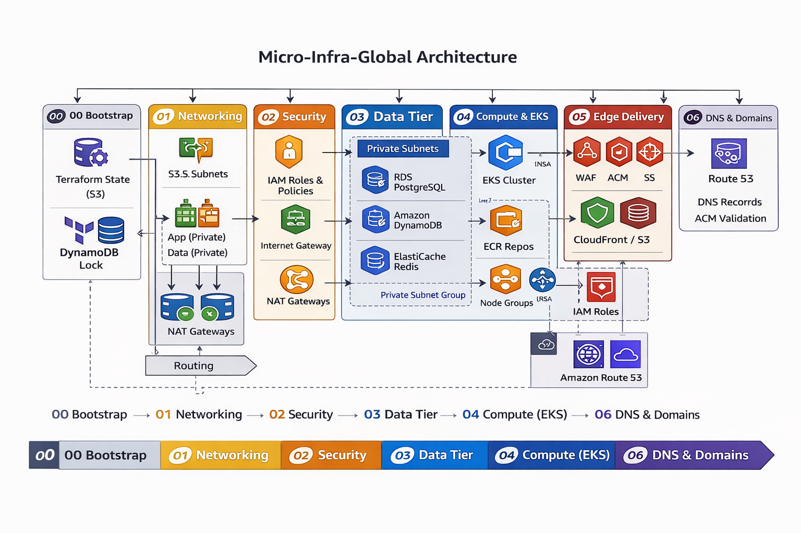

# 🛒 **Toshiro-Shibakita – Plataforma de E-Commerce**
### *Infraestrutura em AWS • Microsserviços • Java/Spring • DevOps • TDD • Segurança • Alta Disponibilidade*

---

  

---

## 📘 Visão Geral

O **Toshiro-Shibakita** é uma plataforma de e-commerce construída para simular um cenário corporativo real, com **arquitetura distribuída**, **infraestrutura automatizada** e **entrega contínua** na AWS.

O objetivo do projeto é demonstrar uma solução profissional completa, com **microsserviços**, **CI/CD**, **Infraestrutura como Código (Terraform)**, **padrões de engenharia** e uma organização **multirepo**, onde cada domínio tem vida própria.

---

# 🏛️ Arquitetura do Sistema

- Microsserviços (Spring Boot / Java 21) + serviços poliglotas (Go quando aplicável)
- Banco relacional: **PostgreSQL (Amazon RDS)**
- Cache: **Redis (Amazon ElastiCache)**
- Mensageria / Eventos: **Amazon SQS / SNS / EventBridge**
- Infraestrutura como Código: **Terraform**
- Containers: **Amazon EKS** (orquestração) + **ECR** (imagens)
- Segurança: IAM, JWT, Security Groups, NACLs, KMS
- Observabilidade: CloudWatch + X-Ray + OpenTelemetry

---

# 🧩 Domínios e Repositórios (Multirepo)

Este repositório é o **centro de governança da infraestrutura (IaC)**.  
Cada domínio de negócio roda em seu **próprio repositório**, com pipeline e deploy independentes.

> Substitua os links abaixo pelos URLs reais quando publicar os repositórios.

| Domínio / Serviço | Responsabilidade | Tecnologia | Repositório |
|---|---|---|---|
| **micro-infra-global** | Rede, segurança, dados, EKS, borda e DNS | Terraform | **(este repositório)** |
| **catalog-service** | Vitrine, produtos, categorias, mídia | Java 21 / Spring | `[link]()` |
| **inventory-service** | Estoque (source of truth), reservas/baixa | Go | `[link]()` |
| **order-service** | Pedidos, itens, status e integração por eventos | Java 21 / Spring | `[link]()` |
| **auth-service** | Autenticação, autorização, RBAC/JWT | Java / Spring Security | `[link]()` |
| **api-gateway** *(opcional)* | Entrada única, roteamento e políticas | Java / Gateway | `[link]()` |
| **notification-service** *(opcional)* | Processamento assíncrono e avisos | Go | `[link]()` |

---

# 📦 Primeira Feature – *Catálogo de Produtos*

O primeiro microsserviço implementado é o **catalog-service**.

### Funcionalidades
- Listagem de produtos
- Busca e filtros
- Imagens (S3 + CloudFront)
- Consulta de estoque (somente leitura / projeção)
- Cache Redis (ElastiCache)

### Endpoints (exemplo)

---

# 🧱 Padrões e Boas Práticas

- Arquitetura Hexagonal (Ports & Adapters)
- SOLID + Clean Code
- DTOs → Controllers limpos
- Services → Regras de negócio
- Repositories → Acesso ao banco
- Mapeamento com MapStruct
- Versionamento SQL com Flyway
- Exception Handler global

---

# 🔐 Segurança

- Autenticação JWT
- Spring Security
- IAM para serviços e pipelines (privilégio mínimo)
- SGs e NACLs seguindo princípio de menor privilégio
- Dados criptografados em trânsito (TLS) e repouso (KMS/RDS)

---

# 🧪 Qualidade de Software (TDD)

### Testes implementados:
- Unitários (JUnit 5 + Mockito)
- Integração (Testcontainers PostgreSQL)
- Repositórios
- Testes de contrato HTTP
- Linters: Checkstyle, SpotBugs
- SonarCloud no pipeline
- Cobertura alvo: **80%+**

---

# 🚀 CI/CD — GitHub Actions

Pipeline moderno com gatilhos:

- **Pull Request → branches main/dev/stage**
- Build e testes
- Análise de qualidade
- Build Docker
- Push para registry (ECR)
- Deploy automático (Infra + Cluster)

### Fluxo completo

---

# 🏗️ Infraestrutura — Terraform (Stacks Isoladas)

A infraestrutura é organizada em **stacks independentes** para reduzir *blast radius* e permitir evolução granular.

---

# 🔄 Integrações (ERP/PDV)

Eventos principais:
- `inventory.updated`
- `price.changed`
- `product.created`
- `product.disabled`

Sincronização via SQS/SNS/EventBridge (event-driven).

---

# 🔧 Como Rodar Localmente

### Requisitos
- Java 21
- Maven
- Docker
- Docker Compose

### Comandos

---

# 🧭 Roadmap

### MVP – Catálogo (FASE ATUAL)
- Microsserviço catálogo
- Infra dev via Terraform
- CI completo
- Deploy no cluster
- Observabilidade mínima viável

### Próximos módulos
- Carrinho
- Checkout
- Pagamentos
- Entregas
- Fidelidade
- Aplicativo mobile

---

# 🛡️ Configurações de Segurança e Qualidade no GitHub

## 🔒 Proteção da branch `main`

No GitHub:
Repositorio → Settings → Branches → Branch Protection Rules

Configure:
- ✔ **Require pull request before merging**
- ✔ **Require code review approvals (min 1 ou 2)**
- ✔ **Require status checks to pass before merging**
  - build
  - test
  - sonarcloud
  - lint
- ✔ **Require signed commits (opcional)**
- ✔ **Require branches to be up to date**
- ✔ **Do not allow bypass**
- ✔ **Restrict who can push to main**

---

### Estrutura da Infra

micro-infra-global/
│
├── 00-bootstrap/                         # cria o backend do Terraform (state remoto)
│   ├── main.tf                           # S3 (tfstate) + DynamoDB (lock)
│   ├── variables.tf
│   ├── outputs.tf
│   └── versions.tf
│
├── 01-networking/                        # rede base (3 camadas)
│   ├── main.tf                           # VPC + Subnets (public/app/data) + IGW
│   ├── nat.tf                            # NAT Gateway(s)
│   ├── routes.tf                          # route tables + associations
│   ├── variables.tf
│   ├── outputs.tf                         # vpc_id, subnet_ids, azs
│   ├── versions.tf
│   └── backend.tf
│
├── 02-security/                          # IAM + Security Groups + KMS base (se quiser)
│   ├── main.tf                            # “master” do passo
│   ├── iam.tf                             # roles/policies (EKS, nodes, etc.)
│   ├── security_groups.tf                 # SG: alb/app/db/cache
│   ├── data.tf                            # remote_state do 01-networking
│   ├── variables.tf
│   ├── outputs.tf                         # sg ids, role arns
│   ├── versions.tf
│   └── backend.tf
│
├── 03-data/                              # DATA TIER (multi-db)
│   ├── main.tf                            # “master” do passo
│   ├── rds/                               # Postgres (um cluster/instância + databases por domínio)
│   │   ├── main.tf                         # aws_db_instance / parameter groups / option groups
│   │   ├── variables.tf
│   │   └── outputs.tf                      # endpoint, port, arn
│   ├── dynamodb/                          # DynamoDB (ex: Catalog em Go)
│   │   ├── main.tf                         # tables + autoscaling (opcional)
│   │   ├── variables.tf
│   │   └── outputs.tf
│   ├── elasticache/                       # Redis (cache/sessão)
│   │   ├── main.tf
│   │   ├── variables.tf
│   │   └── outputs.tf
│   ├── subnet_groups.tf                   # db subnet group / cache subnet group
│   ├── data.tf                            # remote_state: 01-networking + 02-security
│   ├── variables.tf                       # define “quais domínios usam o quê”
│   ├── outputs.tf
│   ├── versions.tf
│   └── backend.tf
│
├── 04-compute-eks/                        # compute (EKS + NodeGroups Spot/OnDemand + ECR)
│   ├── main.tf                            # cluster + addons mínimos
│   ├── nodegroups.tf                      # on-demand pequeno + spot principal
│   ├── ecr.tf                             # repos por domínio (ms-catalog, ms-order, etc.)
│   ├── irsa.tf                            # IRSA/OIDC (pods com IAM)
│   ├── data.tf                            # remote_state: 01-networking + 02-security + 03-data
│   ├── variables.tf
│   ├── outputs.tf                         # cluster_name, oidc_arn, ecr_urls
│   ├── versions.tf
│   └── backend.tf
│
├── 05-edge-delivery/                      # borda (sem DNS)
│   ├── main.tf                            # “master” do passo
│   ├── alb.tf                             # ALB + target groups + listeners (via ingress depois)
│   ├── acm.tf                             # certificados (ex: *.toshiro.asantanadev.com)
│   ├── waf.tf                             # WAF (opcional)
│   ├── cloudfront.tf                      # opcional (frontend/assets)
│   ├── s3_frontend.tf                     # bucket site/asset
│   ├── data.tf                            # remote_state: 01/02/04 (pra pegar VPC/SG/EKS)
│   ├── variables.tf
│   ├── outputs.tf                         # alb_dns, cf_domain, acm_arn
│   ├── versions.tf
│   └── backend.tf
│
├── 06-dns-global/                         # DNS isolado (sempre por último)
│   ├── main.tf                            # Route53 records + validação ACM (se aplicável)
│   ├── data.tf                            # remote_state: 05-edge-delivery
│   ├── variables.tf                       # hosted_zone_id, domain, subdomínios
│   ├── outputs.tf                         # urls finais
│   ├── versions.tf
│   └── backend.tf
│
└── env/                                   # “seus JSONs” do CloudFormation viram TFVARS aqui
    ├── dev.tfvars
    └── prod.tfvars

## 🧑‍💻 Code Review (Best Practices)

Checklist para revisores:
- [ ] Código limpo, sem duplicação
- [ ] Testes cobrindo nova lógica
- [ ] Validações e exceções adequadas
- [ ] Segurança (inputs, dados sensíveis)
- [ ] Logs essenciais
- [ ] Não incluir secrets no código
- [ ] Terraform formatado e validado
- [ ] Dockerfile otimizado
- [ ] Nome de PR claro e descritivo

---

## 👮 Políticas de Permissão do Repositório

Estrutura recomendada:

### Owners
- Ana Lúcia Nunes Lopes de Santa
- 1 líder técnico (fictício)

Permissões:
- **Admin**: somente Owners

### Developers
- Permissão: **Write**
- Não podem fazer push para `main`

### QA
- Permissão: **Triage ou Read**
- Podem revisar PRs

### Bots
- **GitHub Actions** → Permissão: `write` em workflows

Arquivo de permissão (padrão empresa):

---

# 📜 Licença
MIT

---
# 💼 Sobre o Projeto

Este repositório foi criado para consolidar e demonstrar o aprendizado aplicado em:

- Arquitetura distribuída com microsserviços (Java e Go)
- DevOps moderno (CI/CD + Infraestrutura como Código)
- Provisionamento de infraestrutura na AWS com Terraform
- Boas práticas de backend, testes e qualidade de software
- Segurança, governança e organização multirepo

Aqui é onde a **infraestrutura é provisionada e organizada**, enquanto os domínios de negócio vivem em seus próprios repositórios.

